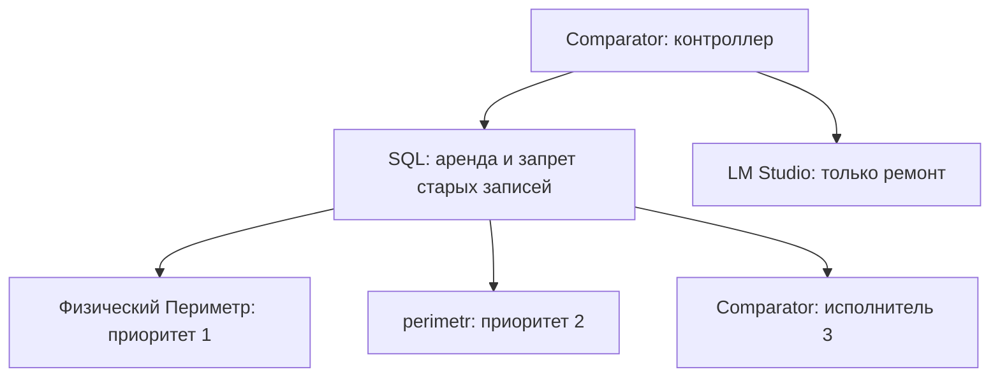

# Резервирование «Периметра»

Код для трёх узлов находится в `feature/perimeter-ha-guardian`. В production
он ещё не установлен. Из среды разработки сеть 172.31.* недоступна, адреса
и доступы к двум VM не получены. Это установка и проверяемый механизм,
а не подтверждение работы на реальном считывателе.

## Топология

| Приоритет | Узел | Роль |
|---|---|---|
| 1 | physical — DESKTOP-OFF5KSM, последний известный IP 172.31.0.188 | Основной Windows «Периметр», D:\Desktop\RFID_KPP-main |
| 2 | perimetr — Ubuntu VM | Подготовленный резерв; запасной контроллер |
| 3 | comparator — Ubuntu VM | Контроллер сравнения и ремонта; третий резерв |

Идентификаторы в JSON должны совпадать на всех узлах. Имя `comparator` в JSON
и hostname `Comparator` могут различаться регистром; URLs заполнить реальными
адресами. Один и тот же SQL Server / база, один HA token на три узла.



Контроллер и ремонт — разные потоки. Медленный или недоступный LM Studio
не задерживает сравнение. На обеих VM запускается одинаковый контроллер;
SQL разрешает только одну его активную аренду. При гибели Comparator запасной
контроллер на perimetr получает её после истечения 15 секунд. Восстановившийся
Comparator остаётся запасным контроллером до следующей смены аренды, чтобы
не прерывать исправный контроль ради переезда арбитра.

Исполнительный стек запускается только после получения аренды. На резерве
работает агент и проверка подготовки, пять бизнес-процессов остановлены.
Так сохраняются независимые SQL cursors/sessions и исключается параллельная
работа двух агрегаторов. Это подготовленный active/passive резерв: задержка
переключения включает запуск DLL и YOLO; бесшовный переход без паузы здесь
не заявляется. Фактическое время нужно измерить на VM.

## Решение о переключении

Сравнение каждые 2 секунды. Агент проверяет действующие `18101..18105/health/ready`
локально: процесс, SDK/read-loop, camera freshness, database, delivery writer,
business-flow и другие зависимости остаются штатными. Нулевое число RFID
чтений или катушек не считается аварией. Базовые probes параллельны.

После первого подтверждённого состояния ready любое degraded/недоступность
ведущего вызывает переключение на подготовленный резерв следующего приоритета.
После запуска предоставляется максимум 120 секунд на полную readiness;
неуспешная попытка заканчивается сменой узла и карантином. При общей аварии
SQL/камер/считывателя резерв может оказаться непригодным: система останавливает
запись и сообщает ошибку вместо бесконечного переключения.

Перед передачей: SQL отзывает старую аренду, пытается остановить старого
исполнителя, затем выдаёт новому owner и новый epoch. В SQL Server triggers
проверяют owner/epoch/срок при каждом INSERT/UPDATE/DELETE. Проверка и commit
сериализуются с передачей аренды. Подключённый до сбоя старый процесс тоже
блокируется. При потере SQL агент прекращает свои процессы, а expires
дополнительно закрывает запись в самой БД. Срок исполнительной аренды — 15 секунд.

**SQL fencing защищает записи, но не является физическим отключением RFID TCP.**
Недоступный зависший ПК может продолжать держать сокет/опрашивать оборудование.
До квалификации нужно проверить, допускает ли контроллер второй TCP client и
освобождается ли первая SDK-сессия. Для строгого единственного владельца самого
оборудования нужен внешний fence: ACL управляемого коммутатора, гипервизор
или питание/сетевой порт. Его нельзя доказать одними health endpoints.

После ремонта независимый preflight должен оставаться успешным 60 секунд.
Затем контроллер ещё 120 секунд наблюдает подготовку перед возвратом на узел
более высокого приоритета. Полный стек проверяется снова уже на пробной
активации. Неудачная активация возвращает систему на резерв и снова изолирует
узел. Ответ модели «готово» не является входом алгоритма.

## UHFAPI.dll под Ubuntu

Используется существующая `RFID_reader_v4/UHFAPI.dll`. Альтернативной библиотеки
и переписывания неизвестного vendor-протокола нет.

`guardian/wine_worker.py` запускается 32-битным Windows Python под Wine.
Он поддерживает только TCPConnect, TCPDisconnect, UHFInventory, UHFStopGet и
UHF_GetReceived_EX. Linux reader использует тот же parse_buf, durable spool,
SQL writer и monitored adapters. 32-битному процессу под Wine не нужен Windows
pyodbc/SQL driver: SQL остаётся в нативном Linux Python.

JSON идёт по локальным stdin/stdout, не через открытый сетевой RPC-порт.
Каждый ответ связан с номером запроса; буфер ограничен 512 байтами.
Ошибочная последовательность/EOF/таймаут уничтожает процесс моста.
Существующий watchdog SDK продолжает действовать.

`doctor` загружает DLL и разрешает exports без TCPConnect/инвентаризации.
Реальное чтение и reconnect тестируются отдельно при отозванной аренде старого
считывателя. Если Wine не загружает библиотеку или реальные вызовы не проходят,
узел не считается пригодным резервом. Без теста vendor DLL совместимость
не гарантирована.

## LLM и команды ремонта

LM Studio: `http://172.31.0.153:49572/v1`.

| Модель из предоставленного списка | Использование |
|---|---|
| openai/gpt-oss-20b | Основная: анализ доказательств и выбор следующего инструмента |
| qwen/qwen3-vl-8b | Резерв при отсутствии/ошибке основной модели, текстовый режим |
| qwen_qwen3.5-0.8b | Не исполняет ремонтные решения |
| text-embedding-nomic-embed-text-v1.5 | Не требуется для текущего контроллера |
| glm-ocr | Не требуется для системных сбоев |

Выбор двух старших моделей — инженерная исходная настройка, не результат
сравнительного теста на этом сервере. `/v1/models` проверяется перед запросом.
Требуется structured output json_schema, temperature=0, проверка полного JSON,
точных полей, enum и finish_reason. Не прошедший проверку ответ не выполняется.
Документация: https://lmstudio.ai/docs/developer/openai-compat/structured-output.

Модель выбирает один инструмент из каталога:

| Инструмент | Что действительно исполняется |
|---|---|
| diagnose | Проверки и ограниченный очищенный хвост лога выбранного сервиса |
| restart_service | Сброс остановленных процессов и повторный preflight; старт стека только по новой аренде |
| restore_release | Новый git worktree точного установленного SHA; старый каталог сохраняется |
| repair_dependencies | Новый venv, pip по утверждённому requirements, тесты; смена окружения после успеха |
| rollback_release | Возврат на сохранённый предыдущий каталог/интерпретатор |
| verify | Независимая проверка подготовки; без прямого снятия карантина |
| wait | Закончить текущую попытку, повторить позднее |

Исполнение subprocess с `shell=False`; произвольные bash/cmd, текст из логов,
SQL и имена системных служб не передаются в shell. Windows и Linux команды
зафиксированы кодом. Сначала выполняется обычный сброс даже без LLM. Затем до
6 шагов на попытку; повтор каждые 300 секунд. Изменяющих операций максимум
3 за 10 минут на узел, лимит сохраняется между перезапусками.

Ремонт ведущего запрещён в самом агенте по актуальной SQL аренде. Если агент
недоступен, можно настроить `rescue_argv` для соответствующего узла: точный
SSH/PowerShell/systemctl вызов, заданный оператором, а не моделью. Например
SSH с forced-command, позволяющим только restart perimeter-guardian. Пароли,
ключи и локальные CMD-конфиги в Git не сохранять. Выключенный компьютер без
доступного гипервизора/питания модель включить не сможет.

Гарантируется ограничение полномочий и проверка результата при корректной
SQL-конфигурации. Успешный ремонт любого неизвестного сбоя LLM не гарантируется.
Когда доступные процедуры не помогают, резерв продолжает работу, узел остаётся
в карантине, попытки/причины видны в мониторинге.

## Установка Ubuntu VM

1. Проверить Ubuntu amd64 22.04/24.04, DNS заводских SQL/камер, маршруты,
   NTP и ресурсы для CPU YOLO двух камер. Swap не заменяет достаточную RAM.
2. Запустить `sudo bash deploy/ha/install-ubuntu.sh` из этой ветки.
3. В `/etc/perimeter/node.json` выбрать node_id `perimetr` или `comparator`,
   заполнить два реальных VM URLs во всех трёх конфигурациях. На обеих VM
   controller_enabled=true; на Windows false.
4. Заполнить `/etc/perimeter/environment` значениями из **локального**
   production `deploy/config_v3.cmd`; сохранить chmod 600. Использовать одну
   и ту же выходную SQL базу для RFID/KPP/Web/DST и HA.
5. DLL/weights/masks берутся из clone. При исходных нестандартных путях
   явно задать их в JSON env. Runtime spools хранить вне каталога release.
6. Для Comparator при необходимости: `sudo bash deploy/ha/enable-swap.sh`.
   Скрипт создаёт только новый 8 GiB swap на ext4/xfs при ≥12 GiB свободных,
   не меняет существующие swap-файлы.
7. Установить SQL migration 003, затем выполнить doctor. Секреты systemd
   EnvironmentFile автоматически попадают только в сервис. Для интерактивной
   проверки использовать защищённую сессию с теми же переменными.
8. После готовности трёх агентов:
   `sudo systemctl enable --now perimeter-guardian`.

Пример команды при уже загруженном локальном окружении:

```bash
cd /opt/perimeter/source
/opt/perimeter/venv/bin/python -m guardian --config /etc/perimeter/node.json doctor
```

Установщик оставляет существующие конфиги нетронутыми, не запускает стек
автоматически до заполнения параметров. ODBC Driver 18 ставится нативно;
Microsoft EULA принимается установщиком. Время capture совместимо с Windows:
Linux timezone Europe/Moscow, NTP синхронизирован.

## Windows и SQL cutover

Работать в отдельной установленной копии этой ветки, сохранив исходный каталог
и его spools/config. `windows.example.json` рассчитан на подтверждённый путь;
пути при другой копии изменить, включая run-windows.cmd.

1. Скопировать пример Windows JSON в `D:\PerimeterHA\node.json` и заполнить VM URLs.
2. Создать `D:\PerimeterHA\secrets.local.cmd` из secrets.example.cmd: общий token,
   HA SQL login. Production config остаётся локальным.
3. В защищённом CMD вызвать production config и secrets.local.cmd. Под migration
   login применить `python -m guardian --config ... migrate` **без --enable**.
   Не применять старую migration 001 повторно после включения HA.
4. Запустить doctor на обеих VM и Windows. Полный независимый Windows doctor
   требует остановленных бизнес-процессов, чтобы доказать свободные порты;
   предварительно можно проверить все существующие health/ready и подготовку VM.
5. Зарегистрировать scheduled task через install-windows.ps1. Он не начинает
   переключение сам. Если исходная папка получена ZIP-архивом и не имеет .git,
   установщик создаёт git clone в D:\PerimeterHA\source и меняет только root /
   update_source в HA JSON. Config, venv и spools остаются в прежних местах.
   Для этого нужен Git for Windows. Доступ порта 18200 разрешать только заводским узлам.
6. В окно переключения отключить старые автозапуски RUN_RFID_KPP_FINAL/ProcessHost
   и закрыть **все CMD supervisor loops**, иначе они снова запускают workers.
   Остановить только процессы этого проекта, сохранить SQLite spools.
7. Запустить три агента, убедиться в prepared=true; Enabled пока 0, записи старой
   системы не блокируются. Выполнить `migrate --enable` и Start-ScheduledTask
   PerimeterGuardian, если он ещё не работает. Не использовать старый launcher.
8. Проверить owner=physical, все пять readiness, web 5050, SQL cursors/spool delivery.
   Выполнить контролируемые отказы ниже до признания резерва production.

Migration 003 изначально Enabled=0. При включении старые соединения без session
identity теряют право записи. Она защищает только выходы «Периметра»:
RFID_Tags, RusGuardLogs, ReelTransitions, KPP_ReelEvents, KPP_RuntimeState,
KPP_ActiveRfidSessions, KPP_ProcessingErrors, KPP_EventVideoLinks,
KPP_EventSkudLinks. Входы Warehouse/RfidTags из 1C не блокируются.
Нестандартные имена выходных таблиц сначала адаптировать в migration/probes.

SQL runtime user не должен иметь права отключать triggers/менять схему.
Migration выполняет отдельный administrator. HA login имеет доступ к трём
KPP_HA_* таблицам; business login — к своим прежним выходам и session_context.
Разделение ролей нужно проверить на вашей БД. SQL Server 2016 SP1+.

## Автообновление main

После слияния **проверенной** ветки в main агенты раз в 60 секунд получают
новый exact SHA. git pull поверх работающих файлов не применяется.

Новая версия: отдельный worktree → все unittest → проверки подготовки.
Force-push с разрывом ancestry main отвергается; начальная feature-установка
и последующий squash merge поддерживаются. Schema migrations не выполняются
из автообновления; изменение SQL-контракта требует отдельного согласованного
развёртывания. Конфиги/секреты/SQLite лежат снаружи release и не заменяются.

Сначала версия активируется на остановленном резерве. После устойчивой
подготовки контроллер переносит нагрузку на обновлённый резерв, прежний ведущий
тоже обновляется и после проверки возвращается по приоритету. Через 60 секунд
полной readiness версия подтверждается. При сбое пробной версии: карантин,
переключение на другой узел, откат на previous, SHA добавляется в persisted
rejected list. Для повторной попытки исправить ошибку новым commit в main.

Автообновление использует уже подготовленные зависимости; missing dependencies
отвергают кандидат. Их восстановление создаёт новый venv по отдельной процедуре.
Следить за свободным местом release_dir и хранить текущую/previous версии;
сохранённые worktrees автоматически не удаляются. Локальная модификация
главной рабочей копии не перетирается.

## Мониторинг

Штатные порты 18101–18105, existing Zabbix DESKTOP-OFF5KSM/172.31.0.97,
Sentry проекты 21–25 и Grafana остаются. Агент: 18200.

* GET /health/ready — краткая готовность/роль без секрета.
* GET /status — полный очищенный status, Bearer PERIMETER_HA_TOKEN.
* GET /metrics — Prometheus gauges/counters: active, ready, prepared, faulted,
  epoch, audit events/dropped. См. prometheus.example.yml.
* Audit JSONL в state_dir: переходы, ошибки, инструменты, обновления; 10 MiB rotation.
* Логи каждого worker ограничены 10 MiB плюс три предыдущих файла.
* HA warnings идут в существующий Sentry Aggregator project 24.

Zabbix additions описаны в zabbix-items.md. При standby остановленные пять
процессов ожидаемы; существующие service triggers должны учитывать роль агента.
Новых проектов Sentry/дублей существующих Zabbix host не создавать.
Не возвращать perimeter.master.

## Проверки перед вводом

Локальные unit/regression тесты не заменяют интеграционные.

```bash
python -m unittest discover -s tests -v
# Только отдельная НОВАЯ SQL база с именем *_ha_test:
PERIMETER_HA_TEST_SQL='LOCAL_TEST_CONNECTION_STRING' python -m unittest tests.test_ha_sql_integration -v
```

| Испытание на трёх узлах | Что должно подтверждаться |
|---|---|
| Остановить один worker физики после ready | Аренда perimetr, старые записи отклонены, нет дублей UUID |
| Изолировать сеть физики | Запись старого epoch запрещена SQL; проверен доступ нового SDK к считывателю |
| Остановить perimetr при неисправной физике | Comparator исполняет стек |
| Убить Comparator agent/controller | Запасной контроллер perimetr получает аренду; исправный executor остаётся работоспособным |
| Отключить LM Studio | Переключение работает, известный reset выполняется, AI ошибка видна |
| Испортить JSON ответ / предложить команду | Ни один неизвестный инструмент не выполняется |
| Восстановить физику | Проверка подготовки, пробный старт, полный ready, затем приоритет 1 |
| Выпустить дефектный main | Тесты отклоняют либо runtime probation ведёт к откату и quarantine SHA |
| Отключить общий SQL | Все записи прекращаются; не образуются два ведущих |
| Вернуть старый ПК с pending spool | Исходные timestamp/UUID доставляются при его следующей активации |

Сохранять фактические RTO, логи lease/epoch, timestamps, очередь spools и
результат физического чтения метки. Общий SQL, RFID controller, камеры,
гипервизор/питание двух VM остаются общими точками отказа. Репликации всей БД
и межузлового копирования pending SQLite здесь нет. При гибели диска исходного
узла его недоставленные локальные записи могут быть потеряны; нулевой RPO
не заявляется. Для такой гарантии нужен отдельный replicated durable ingest.
